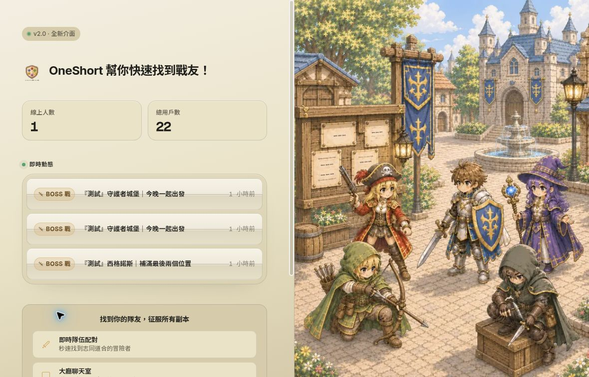
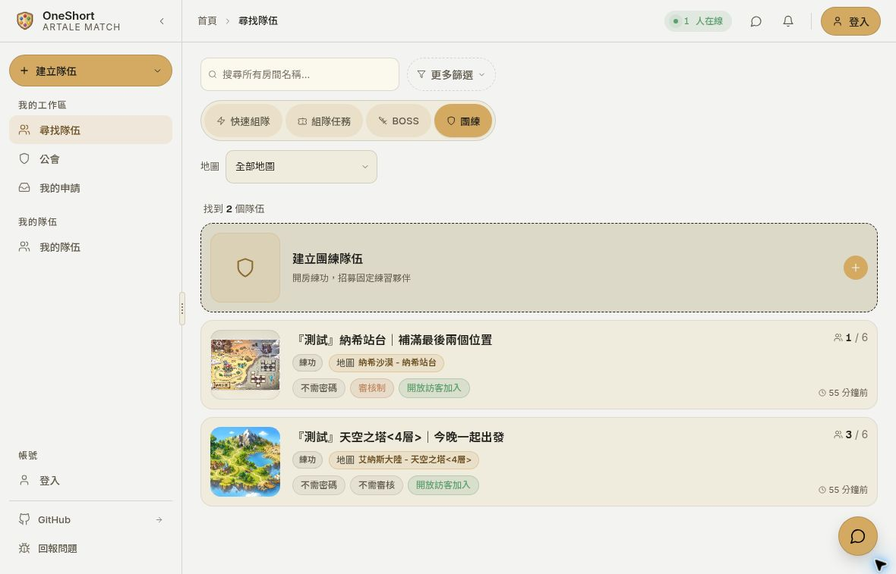
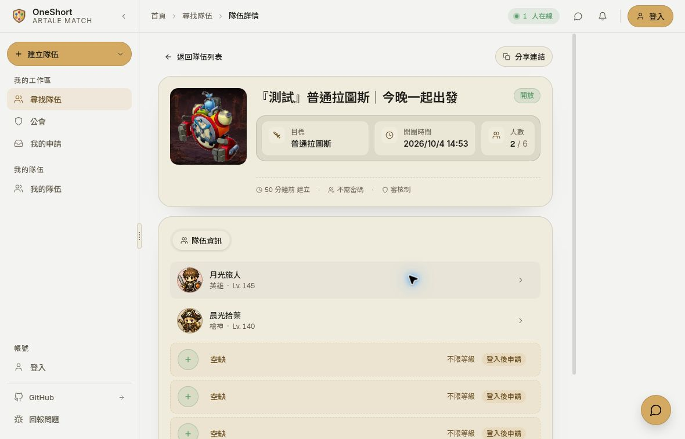
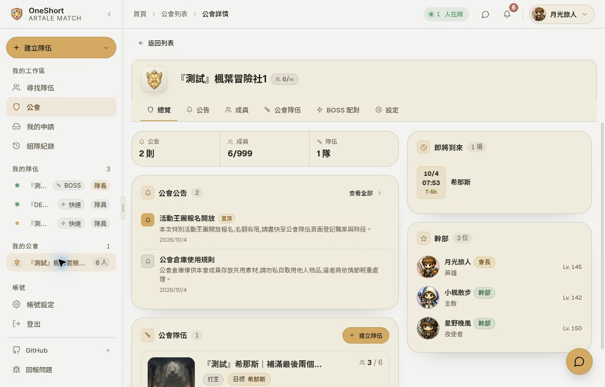
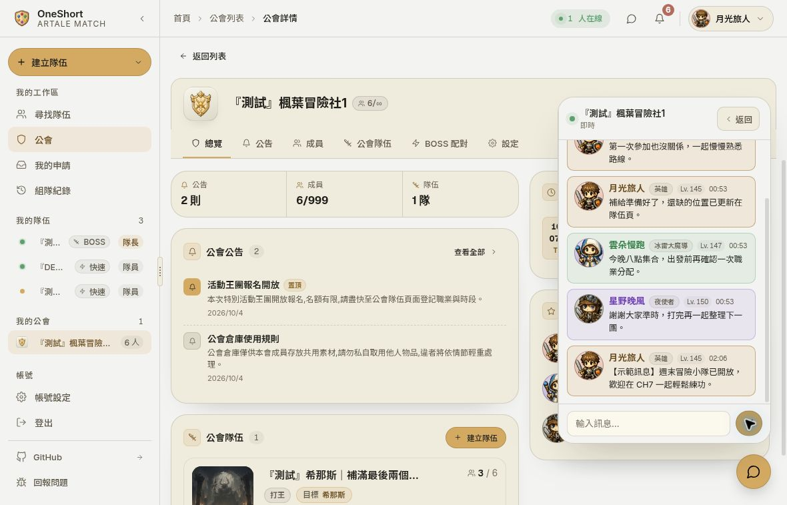

# 缺一 OneShort

**給 Artale 玩家的組隊與公會協作平台**

找人練功、揪 BOSS、解組隊任務，把「還缺誰、幾點出發、誰已經加入」放在同一個地方。

[體驗示範站](https://oneshort-demo-20261004-web.onrender.com/find) · [示範登入與使用說明](docs/demo.md) · [功能介紹](docs/features.md) · [文件目錄](docs/index.md)

以上與下方皆為 2026-10-04 的實際桌面畫面；角色、隊伍、聊天與人數均來自合成示範資料。

## 可以做什麼？

- **找到適合的隊伍**：依組隊任務、BOSS、練功或快速隊伍瀏覽，用名稱、目標、職業、等級與可加入狀態篩選。
- **開團、補位、管理成員**：快速開房，或設定活動目標、職缺、密碼與加入審核；BOSS 團也支援預約時間。
- **邊組隊，邊溝通**：大廳、隊伍與公會各有聊天空間，搭配申請、成員變動及個人通知的即時更新。
- **一個帳號，多個角色**：支援 Discord 與角色代碼＋PIN 登入，管理角色名稱、職業及等級；訪客可參與支援的流程。
- **把公會排團整理起來**：成員填寫 BOSS 順位、時段與本輪參與設定；幹部試算配對、調整草案，再確認產生隊伍。
- **一起完成任務**：支援攻略的組隊任務提供共享進度、分工、清單與順序紀錄；登入玩家可查看最近 30 天的參與摘要。

完整的操作差異與限制見 [功能介紹](docs/features.md)，玩家、房主與公會幹部的流程見 [使用情境](docs/system-overview.md)。

## 實際畫面

| 尋找隊伍 | BOSS 隊伍詳情 |
| --- | --- |
|  |  |
| 依玩法與地圖找團，先看清楚條件 | 查看活動目標、成員及待補職缺 |

| 公會總覽 | 公會即時聊天 |
| --- | --- |
|  |  |
| 把公告、成員與活動集中管理 | 留在公會頁就能和隊友協調 |

畫面中的資料僅用於展示，不代表真實使用者或營運規模。另見 [快速隊伍協作畫面](docs/demo.md#快速隊伍協作畫面)。

## 體驗示範站

1. 開啟 [示範站](https://oneshort-demo-20261004-web.onrender.com/find)，先瀏覽隊伍、切換活動分類或試用篩選。
2. 點選右上角「登入」→「Demo 帳號快速登入」，使用共用示範帳號。
3. 查看示範公會、公告與聊天，也可以走一遍快速開團表單。

這是使用合成資料的公開、共用環境，其他體驗者的操作可能改變畫面。請勿輸入個人資料、真實密碼或連結個人帳號。快速開團、一般加入與隊伍聊天已完成實際驗證，體驗範圍與提醒見 [示範使用說明](docs/demo.md)。

Render 免費服務閒置後可能休眠，首次開啟請稍候喚醒。暫時性的示範資料庫將於 **2026-11-03 UTC** 到期，之後示範站可能停止互動；可繼續透過本頁截圖與文件了解產品。

## 技術簡介

| 層次 | 主要技術與用途 |
| --- | --- |
| 前端 | Next.js 16、React 19、TypeScript；Tailwind CSS 與 shadcn/ui 建立介面 |
| 狀態管理 | TanStack Query 管理伺服器資料，Zustand 管理本地互動狀態 |
| 後端 | Go、Gin，處理組隊、公會與角色等業務規則 |
| 資料與即時互動 | PostgreSQL、Redis、HTTP API 與 WebSocket |

前後端分離，透過 HTTP 完成查詢與操作，再以 WebSocket 更新相關畫面。設計摘要見 [系統總覽](docs/system-overview.md) 與 [精簡架構文件](docs/index.md#技術補充)。

## 關於這個儲存庫

這裡提供 OneShort 的公開產品介紹、實際畫面與架構摘要，方便玩家、開發者及有興趣合作的人了解專案。前後端程式碼另行管理，本儲存庫不含完整應用程式或部署套件。

[專案原網址](https://oneshort.tian1224.uk/) 的開放情況依實際部署狀態而定；本次體驗請使用上方示範站。功能說明依 2026-10-03 的實作整理，示範畫面與體驗說明更新於 2026-10-04。
