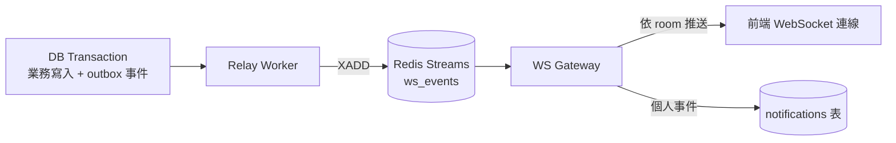

# OneShort 資料流

本文件說明 OneShort 的資料如何流動：前端如何發出操作、後端如何處理、狀態變更如何即時回到所有相關使用者的畫面。

## 1. 一般請求生命週期

```text
瀏覽器
  → Middleware（認證、限流）
  → Handler（HTTP 層）
  → UseCase（業務邏輯與權限驗證）
  → Repository（資料存取）
  → PostgreSQL / Redis
```

1. 使用者在前端操作（建立隊伍、送出申請、讀取通知）
2. 前端透過 HTTP API（`/api/v2`）向後端送出請求，Cookie 內的 JWT 帶出帳號身份
3. 後端驗證身份、權限與業務規則
4. 後端寫入或讀取資料，回傳結果
5. 前端以 TanStack Query 更新資料快取與畫面

## 2. 即時事件管線（Outbox → Streams → WebSocket）

狀態變更的即時同步是整個系統的核心設計：



1. 某個狀態發生變化（申請被核准、成員加入、隊伍關閉）
2. 後端在**同一個資料庫交易**內完成業務寫入並寫入 outbox 事件（Transactional Outbox 模式），確保「資料更新」與「事件通知」的原子性
3. Relay Worker 將 outbox 事件發布到 Redis Streams（事件流有長度上限，自我設限避免記憶體失控）
4. WebSocket Gateway 消費事件流，依房間（room）把訊息推送給相關使用者的連線；個人事件同時持久化為通知
5. 前端收到事件後做針對性的畫面更新或資料重抓

失敗保護：投遞具備 consumer group 層級與全域副作用層級的去重機制，無法處理的事件進入 dead-letter stream。

## 3. 房間路由

| Room | 誰會收到 | 典型事件 |
|------|----------|----------|
| `actor:{actor_id}` | 該帳號本人 | 申請結果、個人通知、角色更新 |
| `party:{party_id}` | 隊伍成員與正在檢視詳情的人 | 席位變更、成員加入 / 離開、聊天 |
| `parties:global` | 所有在隊伍列表頁的人 | 列表刷新提示 |
| `lobby:chat` | 所有開啟大廳聊天的人 | 大廳訊息 |
| `guild:{guild_id}` | 公會成員 | 公告、成員異動、配對完成 |

## 4. 典型場景

### 建立隊伍

1. 使用者送出表單，後端建立隊伍與席位，並在同交易寫入 `party.created` 事件
2. 前端接收成功結果並導向隊伍頁
3. 其他使用者透過 `parties:global` 事件看到列表更新

### 申請與審核

1. 玩家送出申請；若隊伍設定允許自動核准且條件相符，直接入隊
2. 需要審核時，隊長透過個人房間與隊伍房間收到提示
3. 隊長核准後：申請者收到結果通知、隊伍房間廣播成員加入、該角色在其他隊伍的待審申請自動取消
4. 雙方畫面即時同步，不需手動刷新

### 角色資料更新

角色改名或換職業時，後端先透過內部事件同步所有引用位置（席位快照、申請快照、聊天歷史的發送者快照、通知內容），完成後才發出前端可見的刷新事件，確保各畫面看到一致的角色資訊。

### 通知

1. 業務事件成立後，WS Gateway 在投遞的同時將個人事件持久化為通知
2. 在線使用者立即看到推播與未讀數更新；離線使用者下次進站時從通知中心讀到完整紀錄

## 5. 前端狀態與後端狀態

- **前端本地狀態（Zustand）**：面板開關、表單內容、篩選條件、連線狀態
- **伺服器資料狀態（TanStack Query）**：隊伍列表、通知列表、隊伍詳情
- 即時事件的角色是「觸發正確範圍的失效與重抓」，而不是直接改寫前端狀態，讓資料來源保持單一

## 6. 背景工作

| 工作 | 說明 |
|------|------|
| 閒置檢查 | 對立即隊伍發出閒置警告並自動關閉，透過索引批次檢查 |
| 每日統計 | 午夜彙整在線與使用統計 |
| 公會自動配對 | 每週依成員偏好產生 BOSS 隊伍 |
| 快取預熱 | 隊伍列表等熱路徑快取的預先載入 |

## 7. 設計重點

- 關鍵狀態變更不依賴單次刷新——事件推播是第一公民
- 「資料寫入」與「事件發布」同交易，不會出現資料改了但沒人收到通知的中間態
- 前端優先更新受影響範圍，而不是每次重載整站
- 即時層故障時系統仍可運作，使用者可透過重新整理取得最新狀態
