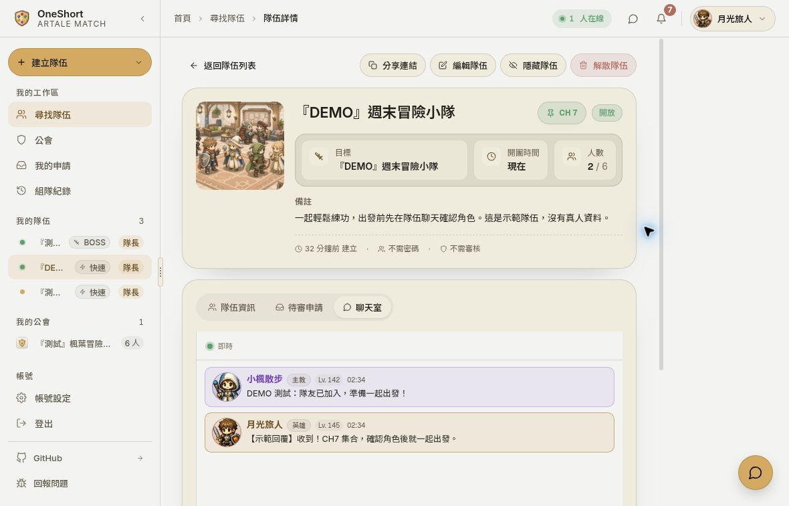

# 體驗 OneShort 示範站

[開啟公開示範站](https://oneshort-demo-20261004-web.onrender.com/find)

這個環境使用合成角色、隊伍、公會與聊天資料，供大家瀏覽產品及試用互動。示範帳號由體驗者共用，資料可能因其他人的操作而改變。

## 示範登入

1. 開啟示範站，等待頁面完成載入。
2. 點右上角「登入」。
3. 選擇「Demo 帳號快速登入」，即可使用預先準備的角色與公會。

請使用這個示範入口，不要輸入個人資料、真實密碼，或把自己的 Discord 等個人帳號連結到共用帳號。新建的隊伍或聊天內容也請維持為示範資料。

## 可以先試這些流程

- **找隊伍**：切換玩法、搜尋房名、選擇地圖／BOSS，或展開職業與等級篩選。
- **看詳情**：打開 BOSS 隊伍，查看活動目標、角色、職缺與加入條件。
- **快速開團**：輸入示範房名與頻道，再選擇加入方式；也可以返回上一步修改或取消。
- **逛公會**：從左側公會入口查看示範公告、成員與活動。
- **公會聊天**：在示範公會打開聊天面板，用明確標示為示範的文字體驗交流。

2026-10-04 已實際確認示範登入、搜尋篩選、隊伍詳情、快速建團、一般加入、隊伍聊天及公會聊天；並確認新成員與訊息會即時更新至隊伍畫面。

## 快速隊伍協作畫面

這張圖展示快速隊伍的隊長身分、已加入的成員及雙方聊天訊息。其餘畫面見 [專案首頁](../README.md#實際畫面)。

## 開放時間與資料提醒

- **公開共用**：角色、隊伍、訊息與統計都是示範資料，畫面不代表真實使用者或營運規模。
- **可能需要喚醒**：Render 免費服務閒置後可能休眠。首次開啟較慢時請稍等，必要時重新整理。
- **暫時性環境**：示範資料庫將於 **2026-11-03 UTC** 到期。之後可能無法登入或操作，不承諾持續開放。
- **截圖範圍**：本次圖片為 2026-10-04、1180 × 757 桌面視窗的原始截圖。

功能與操作資格仍會依房型、角色、成員身分及當下資料不同。完整說明見 [功能介紹](features.md)。

回到 [專案首頁](../README.md) · [文件目錄](index.md)
