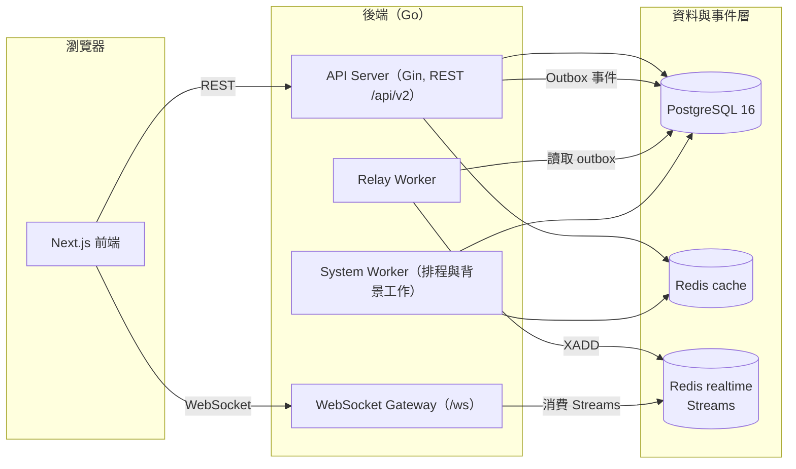

# OneShort 系統總覽

OneShort 是一個為 MMORPG 玩家打造的即時組隊協作平台，目標是讓玩家更快找到隊伍、更順暢地管理成員，並在關鍵狀態變化時獲得即時通知。

## 1. 產品核心目標

- 降低建立隊伍、搜尋隊伍與加入隊伍的操作成本
- 提供即時狀態同步，減少等待與重複確認
- 串接公開組隊、公會協作、通知與管理功能
- 以訪客（快速登入）流程降低首次使用門檻

## 2. 核心概念

| 概念 | 說明 |
|------|------|
| Actor | 帳號層身份。所有登入方式（Discord OAuth、快速登入）最終都解析成同一種 actor，不區分使用者型別 |
| Character | actor 底下的遊戲角色，帶有職業與等級；一個 actor 可擁有多個角色，並指定目前使用的角色 |
| Party | 隊伍。依目標分為練功、BOSS、任務等類型；依生命週期分為立即（快速）隊伍與排程隊伍；依可見性分為公開、密碼房與公會隊伍 |
| Guild | 公會。提供成員管理、公告、聊天與 BOSS 隊伍自動配對等長期協作能力 |
| Room | 即時事件的推播單位，例如個人房間（`actor:{id}`）、隊伍房間（`party:{id}`）、全域列表與公開大廳 |

## 3. 整體架構

- **API Server**：處理所有 REST 請求，業務寫入與事件（outbox）在同一個資料庫交易內完成
- **Relay Worker**：把 outbox 事件轉發到 Redis Streams
- **WebSocket Gateway**：消費事件流，依房間把訊息推送給對應的前端連線
- **System Worker**：負責閒置隊伍關閉、每日統計、公會每週自動配對、快取預熱等背景工作

## 4. 技術棧總表

| 層次 | 技術 |
|------|------|
| 前端框架 | Next.js 16（App Router）、React 19、TypeScript 5 |
| 前端狀態 | TanStack Query 5（伺服器狀態）、Zustand（本地狀態） |
| 樣式 | Tailwind CSS 4、Radix UI / shadcn |
| 後端語言與框架 | Go 1.24、Gin |
| 資料庫 | PostgreSQL 16（GORM / sqlx、SQL migration） |
| 快取與即時 | Redis 7 ×2（cache / realtime，Redis Streams） |
| 即時通訊 | gorilla/websocket |
| 認證 | JWT（Cookie session）、Discord OAuth、快速登入（角色代碼 + PIN） |
| 可觀測性 | zap 結構化日誌、Prometheus metrics |
| API 文件 | Swagger（swaggo） |
| 測試 | Vitest / Playwright（前端）、testify / sqlmock / miniredis（後端） |

## 5. 功能模組地圖

| 模組 | 說明 | 詳細文件 |
|------|------|----------|
| Auth | Discord OAuth、快速登入、帳號綁定與合併 | [功能總覽 §1](./features.md#1-身份與登入) |
| Party | 隊伍建立、搜尋、申請、席位管理、聊天、生命週期 | [功能總覽 §2](./features.md#2-隊伍系統) |
| Guild | 公會成員、公告、聊天、公會隊伍與 BOSS 自動配對 | [功能總覽 §3](./features.md#3-公會系統) |
| Notify | 通知中心、即時推播、WebSocket | [功能總覽 §4](./features.md#4-通知系統) |
| Announcement | 平台公告與 NoticeBar 跑馬燈 | [功能總覽 §5](./features.md#5-公告與跑馬燈) |
| Stats | 在線人數與每日統計 | [功能總覽 §7](./features.md#7-在線統計) |
| Admin / Telegram | 管理後台與 Telegram Bot 營運入口 | [功能總覽 §8](./features.md#8-管理端) |

## 6. 使用者體驗重點

- 快速進入組隊流程：訪客也能以低門檻建立或加入快速隊伍
- 清楚看見申請、加入與狀態更新結果：關鍵變更即時推播，不依賴手動刷新
- 桌機與行動裝置皆可操作，行動版有獨立的互動設計
